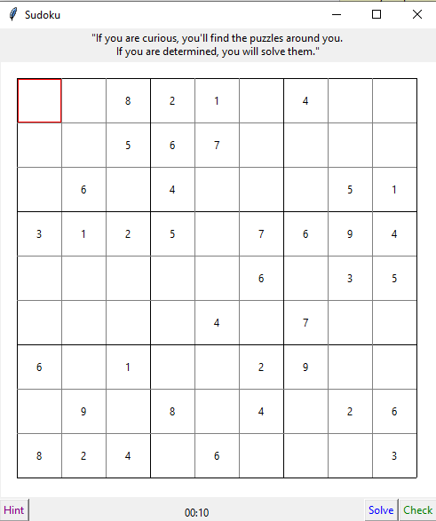

# Sudoku_solver
Solve any Sudoku

# How to

Open the folder in your terminal and run
```
pip install -r requirements.txt
```

to install all the dependencies.

## Solving a sudoku
If you want to solve any sudoku, add it to the examples of sudoku_examples.py file and then import it. Then run sudoku_solver.py

## Playing with it
Run sudoku_with_UI.py to solve some sudokus using a grafical user interface.

### Randomly-generated sudokus
By default it will randomly generate sudokus with 43 empty spaces. It starts with a randomly-created, already-solved sudoku.
Then it tries to remove a number in a random position and tries to solve it. If the solution is the same as the original sudoku, it keeps on. Until it has removed 43 numbers.
This number can be edited, although with higher numbers it takes longer to generate the sudoku.

See sudoku_solver.randomized_sudoku function for more info.

If you want, you can run this code online on Gitpod
[](https://gitpod.io/#https://github.com/inimaz/Sudoku_solver) 

# Acknowledgments
The GUI was inspired by http://newcoder.io/gui/part-3/. Very interesting tutorial to get started with tkinter.
	
## Sudoku example

